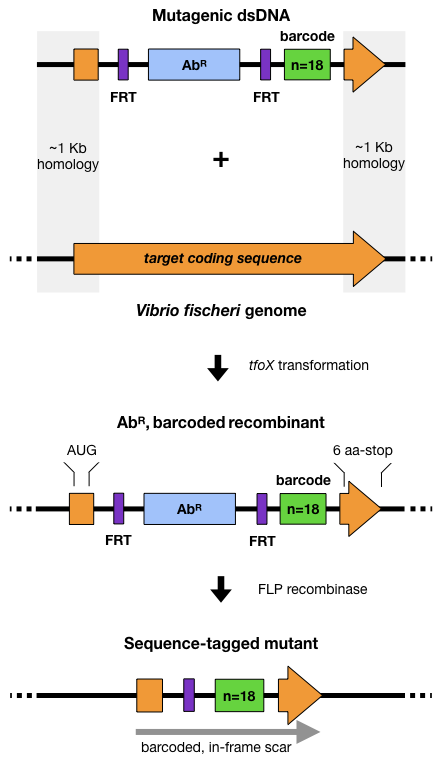
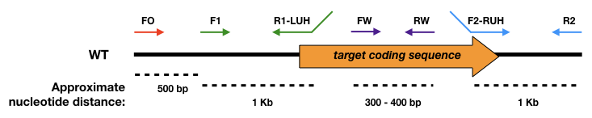
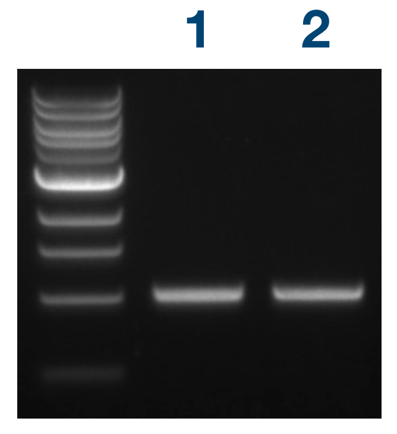
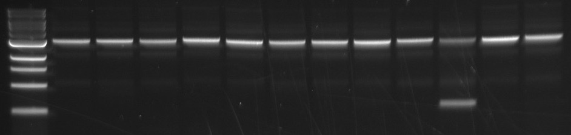
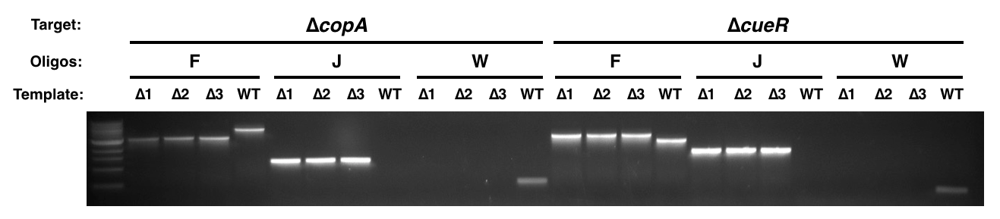
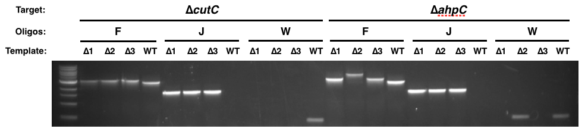

# Sequence Tagged Gene Deletion

Protocol by Hector Burgos

This is a concise version of the [2024 Current Protocols published protocol](https://doi.org/10.1002/cpz1.70024) with the key steps most relevant for our laboratory. See the full protocol for additional details, caveats, and planning considerations.

**2021-05-27 Important:** I need to update this protocol. I wrote it when I had not done this procedure many times and there are some things I do differently now. One of these is the oligos that I use to screen the different mutants. For the gene::erm-bar constructs, the sequencing should be done with oligos FO, RO, erm-left-out (HB8), and erm-right-out (HB9). For the gene::bar constructs, the sequencing should be done with oligos FO, RO, LL (HB42), and RL (HB146).

This protocol details how to generate a clean deletion of target genes in *Vibrio fischeri* where each deletion strain is tagged with a unique sequence or "barcode".
SOE-PCR is used to generate the Mutagenic DNA (linear dsDNA carrying ErmR and the barcode, flanked by FRT sites and upstream and downstream homology to target gene; arranged as follows: US homology-FRT-ErmR-FRT-barcode-DS homology) and *tfoX* transformation is used to insert it into *V. fischeri* where it recombines into the chromosome based on sequence homology.
The deletion at this stage is named *gene::erm-bar* (bar = barcode).
This technique then allows for the excision of the ErmR cassette by inserting a plasmid that expresses FLP recombinase, which uses the FRT sites to remove the antibiotic cassette.
The resulting scar is in-frame (reduces likelihood of polar effects on gene expression) and carries a barcode that allows identification of the specific deletion strain through sequencing.
The gene deletion after removal of the ErmR-cassette is called *gene::bar*.
One important detail is that the start codon and the last 7 codons (6 aa plus stop codon) of the targeted gene are preserved and form part of the deletion scar.
The overall approach is summarized below:

## I - Oligo Design

  
Oligos F1 and R1-LL amplify 1Kb upstream of target gene including the start codon with the Left Linker (LL) sequence, while oligos F2-RL and R2 amplify the 1 Kb downstream of target gene including the last 7 codons with the Right Linker (RL) sequence.
Oligo FO anneals 1.5 Kb upstream of target gene and is used to amplify from outside the junction of the mutation to verify insertion of cassette in correct genomic location.
Oligos FW and RW anneal within target gene and should produce no product from a successful gene deletion strain.

I use [Benchling](https://benchling.com) (Biology Software) to design my oligos, so the following instructions are assuming you are also using Benchling.
Otherwise, you can adapt the oligo design to whatever software/approach you use.

1. Generate a sequence file containing the gene of interest and 2 Kb of flanking sequence.
2. Substitute the coding sequence of the target gene with the barcoded ErmR-Marker within the start codon and the last 7 codons (6 aa plus stop codon) of the gene of interest to generate the *gene::erm-bar* sequence file. [Example: Δ*cueR*::erm-bar.](https://benchling.com/s/seq-b4AyxNqFLv25wjchrTqZ)
3. Using the distances shown in the image above as a guide, design oligos with a Tm = 60 ± 3°C (verify Tm with the "Analyze" function of [IDT's OligoAnalyzer 3.1 tool](https://www.idtdna.com/calc/analyzer)). \*Make sure oligo R1 starts with the start codon of the target gene, while F2 should include the last 7 codons (6 aa plus stop codon).
4. Attach the reverse complement of LL to the 5'-end of R1 and RL to 5'-end of F2 to form the R1-LL and F2-RL oligos (LL Reverse complement = CTGGCGAAGCATATATAAGAAGCTCGTCTCGT; RL = GACTTGACCTGGATGTCTCTACCCACAAGATCG).
5. Calculate the predicted secondary structures for the oligos using the "Hairpin" function of [IDT's OligoAnalyzer 3.1 tool](https://www.idtdna.com/calc/analyzer) and reject oligos with predicted structures with a Tm ≥ ~45°C.
6. Generate the *gene:bar* sequence file by deleting the ErmR coding sequence and one of the FRT sites. [Example: Δ*cueR*::bar.](https://benchling.com/s/seq-tAy8XwWMMXY9lVcVhqH8)
This sequence represents the final deletion construct that will be made. Both the *gene::erm-bar* and *gene::bar* files will be used later for analyzing sequencing data.

\* If you are working with FLP sites, avoid generating oligos to FLP sites.
Since it's a palindrome the oligo will likely form a hairpin and not work as intended in a PCR.

## II - Ordering Oligos

Several steps in this section apply only to Mandel Lab members, though other labs can follow the general protocol for ordering oligos from [IDT](https://www.idtdna.com/pages/home).

1. Sign in to [Shop@UW](https://mds.bussvc.wisc.edu/order/shopper_lookup.asp) using the Mandel Lab login, select "Shop at External Suppliers & UW-Madison MDS Warehouse",
 and navigate to Integrated DNA Technologies, Inc.'s webpage.
2. Under "Products & Services" tab, go to "Custom DNA oligos" and select "DNA oligos".
Oligos can be ordered in tubes or in 96-well plates (24 oligos minimum; select "all ordering options" when navigating to "DNA oligos").
3. For ordering multiple oligos:
  - In tubes: select "bulk input", download an oligo input template, fill in your oligos, then upload to IDT.
  - 96-well plate: select "upload plate", download the "Excel plate ordering template", fill in your oligos, and upload. Name your plate with a unique but simple name, as oligo location is entered into Mandel Lab database in the "Plate, well" format. Under "plate specifications", select "normalized yield" for "normalization type", and "calculate" the "quantity (nmol)" and input the max option (e.g., 4-5 nmol).

\* Oligos are generally ordered at the 25 nmole scale, where oligo size is limited to 60 bp for tubes and 80 bp for 96-well plate.
If oligos are larger than the allowed size (usually R1-LL and F2-RL), delete bases from the 5'-end of the oligo until size is reduced to the allowed size (up to 5 bp can be deleted from LL and RL without causing issues downstream; I haven't tested longer deletions); otherwise you can order in 100 nmole scale, though this is not recommended for plates as you will have to order a separate plate for each synthesis scale.

4. Once you are sure that your order is set up correctly, place order in IDT, which will take you back to Shop@UW, then follow the prompts to finish the order.
5. Record order in Mandel Lab supplies log.
6. Once oligos arrive, record order as received, add TE to 100 µM, then prepare 10 µM working dilutions of the oligos (when using plates, prepare the 10 µM working dilutions in 0.2 mL striptubes; this allows the use of a multichannel pipette and ensures appropriate storage of the oligos).

## III - Amplification of Upstream (US) and Downstream (DS) Homology Arms

In this section you will use PCR to generate DNA containing the upstream and downstream homology regions of your target gene.
You will use oligos F1 and R1-LL to amplify the upstream region, and oligos F2-RL and R2 to amplify the downstream region.
Each DNA fragment will contain the linker sequences (LL or RL, at the 3'-end of the upstream fragment or the 5'-end of the downstream fragment, respectively) needed to assemble the Mutagenic DNA fragment later in the protocol.

\* I use Phusion High-fidelity DNAP (NEB Cat. # M0530) for this step, but other high-fidelity enzymes such as Q5 DNAP should work as well.

1. Set up a PCR master mix for the total number of reactions needed (n) plus 10% the total number of reactions (X = n + n*0.1) as detailed below:

| PCR MM (25 µl) | 1 rx.   | X rx.   |
|:---------------|--------:|--------:|
| H2O | 7.5 µl  | 7.5 µl * X |
| 2X Phusion MM  | 12.5 µl | 12.5 µl * X |
| 5 ng/µl ES114 gDNA | 1 µl| 1 µl * X |
| Total =        | 21 µl   | 21 µl * X |

2. Aliquot 21 µl of PCR MM to striptubes.
3. Add 2 µl of 2.5 µM forward oligo to samples; F1 or F2-RL.
4. Add 2 µl of 2.5 µM reverse oligo to samples; R1-LL or R2.

\* I set up reactions using a multichannel pipette, so using 2.5 µM oligo dilutions allows me to pipette 2 µl comfortably (smaller volumes are difficult to pipette accurately with multichannel pipettes); however, a dilution of oligos at a different concentration may be used as long as you adjust the volume of oligo added and compensate with the amount of H2O in the reaction.

5. Mix and spin down samples.
6. Run reactions in thermocycler with Phusion protocol as detailed below:

| Step                 | Temperature       | Time     |
|:---------------------|------------------:|---------:|
| Initial denaturation | 98°C              | 30 sec   |
| 30 cycles:           |                   |          |
| Denaturing           | 98°C              | 5 sec    |
| Annealing            | 60°C              | 20 sec   |
| Extension            | 72°C              | 20 sec   |
| ^ back to denaturing step 29 times |     |          |
| Final extension      | 72°C              | 5 min    |
| Hold                 | 12°C              | For ever |

7. Visualize 2.5 µl of samples in a 1% Agarose gel: mix 2.5 µl reaction + 2.5 µl [6X Purple loading dye](https://www.neb.com/products/b7025-gel-loading-dye-purple-6x-no-sds#Product%20Information) (NEB) + 10 µl H2O. Load 10 µl on gel.

Example of successful reactions (ladder is [1 Kb DNA ladder](https://www.neb.com/products/n3232-1-kb-dna-ladder#Product%20Information) from NEB):

 
8. Purify the DNA from the successful reaction with the QIAquick PCR Purification Kit (QIAgen, Cat. No. 28106) and elute in 30 µl EB buffer.
9. Determine DNA concentration.
10. Store DNA @ -20°C.

## IV - Amplification of Barcoded ErmR Marker

In this section you will generate a DNA fragment containing an antibiotic resistance marker (in this case ErmR) flanked by FRT sites, a spacer, a barcode region, and the LL and RL sequences arranged as follows: LL-FRT-ErmR-FRT-spacer-barcode-RL.
The template used is pHB1, which carries LL-FRT-ErmR-FRT-spacer, and the oligos used are LL (HB42) and ErmR-RL-BarRnd_v2 (HB154: CGATCTTGTGGGTAGAGACATCCAGGTCAAGTCnnbnnbnnbnnbnnbnnbGGAATCAAGTGCATGAGCGCTGAAG).
Oligo HB154 contains 18 semi-random basepairs that result in LL-FRT-ErmR-FRT-spacer-barcode-RL DNA fragments with unique sequences within the barcode region while concurrently ensuring the absence of stop codons within this sequence.
Since only one of these sequence-tagged DNA fragments will replace the target gene, this ensures that each gene deletion is tagged with a unique barcode sequence that is in-frame with the rest of the scar and lacks stop codons.
An oligo with a specific barcode sequence can be substituted for HB154 to generate the same ErmR-carrying DNA fragment with a specific sequence instead of a random one; *e.g.*, HB41 (CGATCTTGTGGGTAGAGACATCCAGGTCAAGTCcagccccgctctagtttgGGAATCAAGTGCATGAGCGCTGAAG).

1. Set up PCR as detailed below:

| PCR MM (50 µl) | 1 rx. |
|:---------------|------:|
| H2O | 22 µl |
| 2X Phusion MM  | 25 µl |
| 10 µM HB42     | 1 µl  |
| 10 µM HB154    | 1 µl  |
| 1 ng/µl pHB1   | 1 µl  |
| Total =        | 21 µl |

2. Mix and spin down samples.
3. Run reactions in thermocycler with Phusion protocol as detailed in section III above with the following modifications:
  - Annealing temperature = 60°C
  - Extension time = 20 S

4. Run whole reactions in a 1% Agarose gel.
5. Cut out 1 kb band from gel.
8. Purify DNA from the gel slices with the QIAgen Gel Extraction kit and elute in 30 µl EB.
9. Determine DNA concentration.
10. Make a 10 ng/µl ErmR-bar DNA working dilution.
11. Store DNA @ -20°C.

## V - SOE-PCR and Generation of Mutagenic DNA

In this section, you will use Splicing by Overlap Extension PCR (SOE-PCR) to fuse the upstream and downstream homology arms with the ErmR Marker DNA fragments into one DNA molecule that I call the Mutagenic DNA.
When inserted into VF, this Mutagenic DNA will replace the targeted gene with LL-FRT-ErmR-FRT-spacer-barcode-RL, generating the desired deletion.
This approach requires that the middle DNA be flanked by the Left and Right linker sequences (generation of the middle DNA fragment containing ErmR is described in section IV of this protocol; ErmR-bar DNA), and that the upstream and downstream homology arms contain the respective linkers so that they can anneal to the middle DNA by sequence homology.
The furthest upstream and downstream oligos, F1 and R2, respectively, are included in the reaction to ensure amplification of the fully assembled 3 Kb product.
The middle DNA fragment can be substituted for a different antibiotic resistance if desired, just as long as it is flanked by the LL and RL sequences.
This protocol can be adapted to high-throughput deletion of genes by using 8- or 12-strip tubes with the different oligos arranged in order so that they can be easily transferred with multichannel pipettes.

1. Set up SOE-PCR master mix for the total number of reactions needed (n) plus 10% the total number of reactions (X = n + n*0.1) as detailed below:

| SOE-PCR MM (25 µl) | 1 rx. | X rx.   |
|:---------------|--------:|--------:|
| H2O | 5.5 µl  | 5.5 µl * X |
| 2X Phusion MM  | 12.5 µl | 12.5 µl * X |
| 10 ng/µl ErmR-bar DNA | 1 µl| 1 µl * X |
| Total =        | 19 µl   | 21 µl * X |

2. Aliquot 19 µl of SOE-PCR MM to 0.2 mL PCR tubes.
3. Add 1 µl of ~10 ng/µl upstream homology arm DNA.
4. Add 1 µl of ~10 ng/µl downstream homology arm DNA.
5. Add 2 µl of 2.5 µM F1 oligo.
6. Add 2 µl of 2.5 µM R2 oligo.
7. Mix reactions and spin down.
8. Run reactions in thermocycler with the SOE-PCR protocol, which is the Phusion protocol as detailed in section III above with the following modifications:
  - Annealing temperature = 60°C
  - Extension time = 1 min

9. Visualize 2.5 µl of samples in a 1% Agarose gel: mix 2.5 µl reaction + 2.5 µl 6X Purple loading dye + 10 µl H2O. Load 10 µl on gel.

Example of successful reactions:

 
In this experiment, all reactions generated the desired 3 Kb DNA fragment, which represents the Mutagenic DNA (US homology-LL-FRT-ErmR-FRT-barcode-RL-DS homology) targeting the specific genes.
The reaction in lane 10 was not as efficient in generating the 3 Kb fragment as the other reactions and it contains an ~750 bp product.
Nonetheless, tfoX transformation of this DNA into MJM1100 pLostfoX was succesful and resulted in ErmR colonies.
Frequently, bands in addition to the desired 3 Kb product are observed after SOE-PCR, but in general they do not seem to interfere with the efficiency of obtaining ErmR colonies after tfoX transformation.

8. Purify DNA from the successful reactions with the QIAquick PCR Purification Kit (QIAgen, Cat. No. 28106) and elute in 30 µl EB buffer.
9. Determine DNA concentration.
10. Store DNA @ -20°C.

## VI - *tfoX* Transformation

In this section you will insert the Mutagenic DNA fragments into VF using natural transformation.
This section follows the [tfoX transformation protocol](https://github.com/mjmlab/protocols/blob/master/tfox-transformation.md) from the Mandel Lab with some modifications.

Recipient strain: MJM1538 = MJM1100 pLostfoX

Day 1
- Inoculate 3 mL LBS-Cam2.5 with MJM1538.
- Grow overnight @ 25°C.

Day 2
- Subculture 30 µl of overnight culture into 3 mL [Tris Minimal Media](https://github.com/mjmlab/protocols/blob/master/media.md#tris-minimal-medium)-Cam2.5 and continue growing overnight @ 25°C.

\* Set up culture in Tris Minimal Media-Cam2.5 late in the day (after 5 pm) so that the culture grows ≤ 15-16 hr, otherwise the subculture the following day will take too long to grow.

Day 3
- Subculture 150 µl into 7 mL Tris Minimal Media-Cam2.5 (protocol normally asks for 3 mL Tris culture, but I need to use a larger volume because each gene deletion requires 500 µl of culture and I'm deleting 12 genes at a time) and continue growing @ 25°C.
- When culture is at OD600 = 0.2, transfer 500 µl of culture into a 2 mL microtube.
- Add 100 ng of Mutagenic DNA, vortex briefly, and incubate @ room temperature (~25°C) for 30 min.
- Add 1 mL of LBS and transfer samples into a 16 mm diamater glass culture tube.
- Incubate overnight @ 25°C for recovery.

Day 4
- Plate 50 µl of cultures onto LBS-Erm5 plates and grow overnight @ 25°C.

\* Only those strains that have substituted the gene targeted for deletion with the ErmR-cassette will grow.

Day 5
- Restreak 3 candidates per gene deletion target onto LBS-Erm5 plates and grow overnight @ 25°C.

Day 6
- Using a single sterile stick, pick a single colony of each candidate and patch onto LBS-Erm5, LBS-Cam2.5, and LBS plates, and inoculate 3 mL of LBS-Erm5.
- Grow overnight @ 25°C.

\* Selection on Erm to confirm insertion of ErmR-cassette, on Cam2.5 to test for absence of pLostfoX (candidate shouldn't grow), and LBS to confirm that lack of growth on Cam2.5 is due to lack of CamR and not to lack of bacteria on stick.

Day 7
- Freeze down temporary glycerol stocks of candidates with the desired phenotype (ErmR and CamS):
  - Transfer 1.2 mL of overnight culture into a strain vial with 600 µl 50% glycerol, vortex, and freeze @ -80°C.

- Harvest 1:10 dilutions of overnight cultures (10 µl culture into 90 µl H2O), vortex, and freeze @ -20°C.
This will serve as template for the Screen PCR in the following section.

## VII - Screening and Sequencing Δ*gene*::erm-bar Candidates

### Screen PCR

In this section, you will perform PCR using the 1:10 culture dilutions harvested in the previous step as template with several oligo pairs that amplify different regions of the gene deletion to screen for the presence of the ErmR-cassette within the region of interest and the absence of the WT gene.
I usually screen the three candidates obtained in the previous step.

| Pair | Forward oligo | Reverse oligo |
|-|-|-|
| Flanking (F) | F1 | R2 |
| Junction (J) | FO | Erm-left-out (HB8) |
| Within (W) | FW | RW |

\* HB8 = ACAAAATTTTAAGATACTGCACTATCAACACACTCTTAAG; anneals within the ErmR-cassette close to the 5'-end and amplifies in the upstream direction.

Expected results depending on template DNA used:

| Oligos | ∆*gene::erm-bar* | WT |
|-|-|-|
| F | Generates a product of ~3 Kb | Generates a product whose size is ~2 Kb + target-gene-size (bp) |
| J | Generates an ~1.5 Kb product | Does not amplify a product because oligo HB8 cannot anneal if the ErmR-cassette is absent |
| W | No product if gene deletion was successful | Amplifies an ~500 bp product (this size can vary as long as oligos are designed to anneal within the WT ORF)|

1. Set up Screen PCR in 0.2 mL tubes on ice as follows:
  - Aliquot 5 µl of 2X OneTaq MM ([NEB #M0482L](https://www.neb.com/products/m0482-onetaq-2x-master-mix-with-standard-buffer#Product%20Information)) into 0.2 mL tubes (either individual or striptubes may be used)
  - Add 1 µl of 1:10 culture dilutions or 1 µl 10 ng/µl gDNA as template.
  - Add 2 µl of 2.5 µM forward oligo to reactions.
  - Add 2 µl of 2.5 µM reverse oligo to reactions.

2. Close tubes (seal if using plates), mix, and spin down.
3. Run reactions in thermocycler with Screen PCR protocol as detailed below:

| Step                 | Temperature       | Time     |
|:---------------------|------------------:|---------:|
| Initial denaturation | 94°C              | 2 min    |
| 30 cycles:           |                   |          |
| Denaturing           | 94°C              | 15 sec   |
| Annealing            | 58°C              | 20 sec   |
| Extension            | 68°C              | 1 min/Kb |
| ^ back to denaturing step 29 times |     |          |
| Final extension      | 68°C              | 5 min    |
| Hold                 | 12°C              | For ever |

4. Visualize 2.5 µl of samples in a 1% Agarose gel: mix 2.5 µl reaction + 2.5 µl 6X Purple loading dye + 10 µl H2O. Load 10 µl on gel. If using Thermo Scientific Owl D3-14 Wide Gel Electrophoresis System (Cat. No. 09-528-128), then run gel @ 140 V for 40 min.

Example of successful reactions:

 
In the gel above the three candidates are run next to reactions performed with WT gDNA for each oligo pair and gene target.
All candidates for both targets have the desired genotype:
  - The Flanking oligos amplify products of different sizes when using template from the gene deletions vs WT.
  - The Junction oligos produce a product with the gene deletions but not from WT.
  - The Within oligos do not generate a product from the gene deletions but do from WT.

Below is an example of a Screen PCRs where one candidate was incorrect (Δ*ahpC*, candidate 2):

 
\* This gel exemplifies why all three oligo pairs are needed to screen for the correct gene deletion genotype. If you skip even one oligo pair, the other two might give the "correct result" even though the strain is not correct.

5. Purify DNA from the successful reactions with the QIAquick PCR Purification Kit (QIAgen, Cat. No. 28106) and elute in 30 µl EB buffer.
6. Determine DNA concentration.
7. Store DNA @ -20°C.

### Sequencing

These instructions are for submitting the sequencing reactions to the University of Wisconsin-Madison Biotechnology Center for Sanger Sequencing of a 96-well plate.
Otherwise the reactions can be performed at a smaller scale and through a different method/institution.
In order to reduce the scale, I sequence the two best candidates per target identified in the screen PCR in the previous section.
The sequencing for the Δ*gene*:erm-bar candidates utilizes oligos that anneal within the left and right linker sequences, and oligos that anneal within the ErmR-cassette.

| Oligos | HB# |
|-|-|
| LL | HB42 |
| RL | HB146 |
| Erm-left-out | HB8 |
| Erm-right-out | HB9 |

Sanger sequencing reaction set up = 24 µl volume with 40-50 ng PCR-amplified DNA and 10-20 pmol oligo.

1. For every oligo, set up one 12-striptube with 8 µl of 2.5 µM oligo per sample in each 0.2 mL tube (e.g., 3 samples + 1 extra = 32 µl 2.5 µM oligo per tube).

Example of set up of 12-striptube for oligos:

| 12-striptube for oligo LL | 1 | 2 | 3 | 4 | 5 | 6 | 7 | 8 | 9 | 10 | 11 | 12 |
|-|-|-|-|-|-|-|-|-|-|-|-|-|
| Volume of 2.5 µM HB42: | 32 µl | 32 µl | 32 µl | 32 µl | 32 µl | 32 µl | 32 µl | 32 µl | 32 µl | 32 µl | 32 µl | 32 µl |

| 12-striptube for oligo RL | 1 | 2 | 3 | 4 | 5 | 6 | 7 | 8 | 9 | 10 | 11 | 12 |
|-|-|-|-|-|-|-|-|-|-|-|-|-|
| Volume of 2.5 µM HB146: | 32 µl | 32 µl | 32 µl | 32 µl | 32 µl | 32 µl | 32 µl | 32 µl | 32 µl | 32 µl | 32 µl | 32 µl |

...plus two more for oligos HB8 and HB9.

2. Aliquot the DNA from the deletion candidates into 12-striptubes making sure to add enough volume for the number of oligos used (e.g., with ~10 ng/µl DNA, use 4 µl per reaction: four oligos per candidate DNA sample + 1 extra = 5 reaction * 4 µl ~10 ng/µl DNA = 20 µl ~10 ng/µl DNA).
Because one usually sequences multiple candidates per deletion target, arrange the candidates as follows to assist in setting up reactions in high-throughput:

Candidate DNA 12-striptubes arrangement:

| 12-striptube #1 | 1 | 2 | 3 | 4 | 5 | 6 | 7 | 8 | 9 | 10 | 11 | 12 |
|-|-|-|-|-|-|-|-|-|-|-|-|-|
| Candidate **#1** for targets: | *geneA* | *geneB* | *geneC* | *geneD* | *geneE* | *geneF* | *geneG* | *geneH* | *geneI* | *geneJ* | *geneK* | *geneL* |

| 12-striptube #2 | 1 | 2 | 3 | 4 | 5 | 6 | 7 | 8 | 9 | 10 | 11 | 12 |
|-|-|-|-|-|-|-|-|-|-|-|-|-|
| Candidate **#2** for targets: | *geneA* | *geneB* | *geneC* | *geneD* | *geneE* | *geneF* | *geneG* | *geneH* | *geneI* | *geneJ* | *geneK* | *geneL* |

3. Transfer 12 µl H2O into wells of a 96-well plate.
4. Using a multichannel pipette, transfer 4 µl of candidate DNA into the corresponding wells of the plate.
Arrange the DNA from the first set of candidates in rows A-D, and candidate #2 DNA in rows E-H.
5. Add 8 µl of 2.5 µM oligos so that each candidate DNA is mixed with each oligo; transfer oligo LL (HB42) into rows A and E, oligo RL (HB146) into rows B and F, Erm-left-out (HB8) to rows C and G, and Erm-right-out (HB9) to rows D and H.
6. Seal plate, mix, and spin down.
7. Submit for full-plate sequencing.

Representative plate layout (when sequencing at UW-Biotech each sequencing data file is labeled following the order of A1 = #1, B1 = #2, C1 = #3, etc; the arrangement shown here results in sequential numbering of the data files for each candidate sample, making subsequent data analysis a little bit easier; e.g., the sequence files for *geneA* candidate #1 will be numbered 1-4, representing the samples in wells A1, B1, C1, and D1):

| | 1 | 2 | 3 | 4 | 5 | 6 | 7 | 8 | 9 | 10 | 11 | 12 |
|-|-|-|-|-|-|-|-|-|-|-|-|-|
| A | *geneA* #1; HB42 | *geneB* #1; HB42 | *geneC* #1; HB42 | *geneD* #1; HB42 | *geneE* #1; HB42 | *geneF* #1; HB42 | *geneG* #1; HB42 | *geneH* #1; HB42 | *geneI* #1; HB42 | *geneJ* #1; HB42 | *geneK* #1; HB42 | *geneL* #1; HB42 |
| B | *geneA* #1; HB146 | *geneB* #1; HB146 | *geneC* #1; HB146 | *geneD* #1; HB146 | *geneE* #1; HB146 | *geneF* #1; HB146 | *geneG* #1; HB146 | *geneH* #1; HB146 | *geneI* #1; HB146 | *geneJ* #1; HB146 | *geneK* #1; HB146 | *geneL* #1; HB146 |
| C | *geneA* #1; HB8 | *geneB* #1; HB8 | *geneC* #1; HB8 | *geneD* #1; HB8 | *geneE* #1; HB8 | *geneF* #1; HB8 | *geneG* #1; HB8 | *geneH* #1; HB8 | *geneI* #1; HB8 | *geneJ* #1; HB8 | *geneK* #1; HB8 | *geneL* #1; HB8 |
| D | *geneA* #1; HB9 | *geneB* #1; HB9 | *geneC* #1; HB9 | *geneD* #1; HB9 | *geneE* #1; HB9 | *geneF* #1; HB9 | *geneG* #1; HB9 | *geneH* #1; HB9 | *geneI* #1; HB9 | *geneJ* #1; HB9 | *geneK* #1; HB9 | *geneL* #1; HB9 |
| E | *geneA* #2; HB42 | *geneB* #2; HB42 | *geneC* #2; HB42 | *geneD* #2; HB42 | *geneE* #2; HB42 | *geneF* #2; HB42 | *geneG* #2; HB42 | *geneH* #2; HB42| *geneI* #2; HB42 | *geneJ* #2; HB42 | *geneK* #2; HB42 | *geneL* #2; HB42 |
| F | *geneA* #2; HB146 | *geneB* #2; HB146 | *geneC* #2; HB146 | *geneD* #2; HB146 | *geneE* #2; HB146 | *geneF* #2; HB146 | *geneG* #2; HB146| *geneH* #2; HB146 | *geneI* #2; HB146 | *geneJ* #2; HB146 | *geneK* #2; HB146 | *geneL* #2; HB146 |
| G | *geneA* #2; HB8 | *geneB* #2; HB8 | *geneC* #2; HB8 | *geneD* #2; HB8 | *geneE* #2; HB8 | *geneF* #2; HB8 | *geneG* #2; HB8 | *geneH* #2; HB8 | *geneI* #2; HB8 | *geneJ* #2; HB8 | *geneK* #2; HB8 | *geneL* #2; HB8 |
| H | *geneA* #2; HB9 | *geneB* #2; HB9 | *geneC* #2; HB9 | *geneD* #2; HB9 | *geneE* #2; HB9 | *geneF* #2; HB9 | *geneG* #2; HB9 | *geneH* #2; HB9 | *geneI* #2; HB9 | *geneJ* #2; HB9 | *geneK* #2; HB9 | *geneL* #2; HB9 |

#### Sequencing Data Analysis

I use [Benchling](https://benchling.com) (Biology Software) for analysis of the sequencing data.
Each gene deletion target is analyzed separately since the sequence data files need to be aligned to the sequence of the desired deletion for each target.

1. Open a sequence file with the *gene::erm-bar* construct made in step I-2.
2. Click on the "Alignments" button on the toolbar to the right, and select "Create New Alignment".
3. Within the "Alignment" window that pops up, click on "Choose File(s)" and select the desired sequence data files to align to the current template.
4. Click on "Create Alignment" (usually takes a few seconds to generate the alignment).
5. Verify the sequences for: 1) Lack of mutations within 1 Kb of US and DS sequence, relative to the target gene. 2) Lack of mutations within LL, FRT sites, RL, and spacer region (all these form the deletion scar after ErmR-cassette is removed, so they need to not have errors) 3) Lack of stop codons within barcode sequence (though using).

## VIII - Removal of ErmR by FLP Recombinase

In this section you will use conjugation to insert pKV496, which codes for the FLP recombinase, into the cell so that FLP can remove the ErmR-cassette, leaving behind an in-frame deletion scar with the unique barcode sequence.
This section follows the [Conjugation protocol](https://github.com/mjmlab/protocols/blob/master/conjugation.md) from the Mandel lab with some modifications.

Donor strain: MJM3478 = *E.coli* π3813 / pKV496
Helper strain: MJM534 = *E.coli* CC118 λpir / pEVS104

## IX - Screening and Sequencing Δ*gene*::bar Candidates

## XI - Final Deletion Verification

## APPENDIX

### Oligos used throughout protocol

| Oligo name | HB# | Sequence |
|-|-|-|
